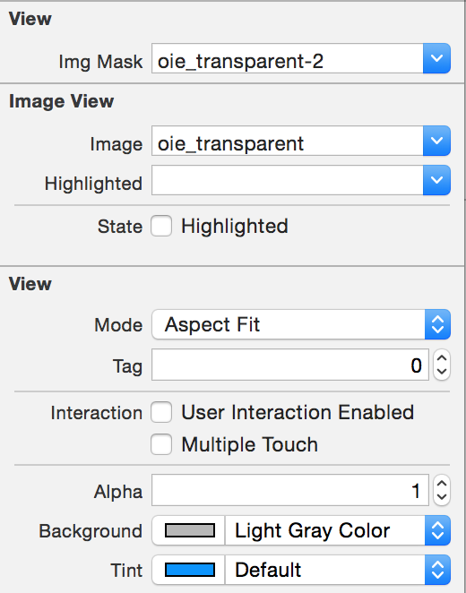
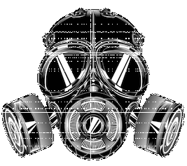

UIView-Mask
===========

Easy way to mask a UIView from IB
  
you'll find a category holding this line
<pre>
@property (nonatomic, strong) IBInspectable UIImage *imgMask;
</pre>
this does all the magic, so in IB you can find a field to set the image you want to use as a Mask   
Img Mask

as you can see it is a UIImageview with this image setted
   

and using this image as mask
   

so here is the result.   

